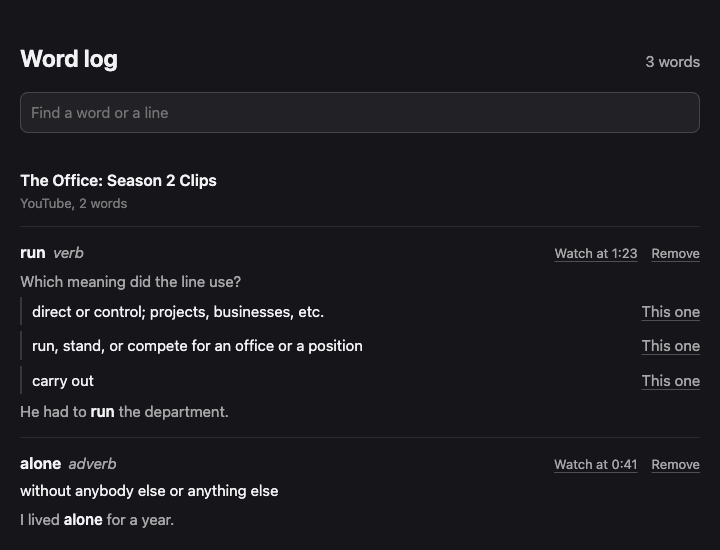

# VocabBoost

Look up a word from a film's subtitles without leaving the film.


Press the shortcut. The video pauses and the subtitle line stays where it was, but its
words are now clickable. Click one and you get the meaning it has in that line, with an
example. Esc, a click anywhere else, or pressing play puts the film back.

None of that needs an account, a key or a network. A small model inside the extension
reads the line and picks the dictionary sense it uses. When the line does not settle it,
the card says so and shows the likeliest few. If you want a written explanation instead,
one more press asks Claude or OpenAI, using your own API key.

## Word log

Every word you look up is kept in a log, with the line it came from and the video. Open
it from the extension's popup. Words are grouped by video, can be searched and removed,
and on YouTube each one links back to the second it was looked up. Where the model was
unsure, the log asks which of its meanings the line used. The log stays on your machine.



## Install

```sh
npm install
npm run build
```

Open `chrome://extensions`, turn on Developer mode, choose Load unpacked, pick
`extension/dist`.

Run the tests with `npm test`. `npm run package` builds the zip for the Chrome Web Store
in `release/`. The store text, screenshots and permission reasons are in `docs/store/`.
Changes between versions are in [CHANGELOG.md](CHANGELOG.md).

The suggested shortcut is `Ctrl+Shift+H` (`⌘⇧H` on macOS). Chrome drops it without
warning if something else already uses it, so check `chrome://extensions/shortcuts`. The
popup links there and shows the one you actually have.

## Models

The meanings come from WordNet, shipped with the extension. A word WordNet does not
have gets a card that says so. There is no pronunciation for now.

One model answers, and the popup says which. The first needs nothing; the rest need a
key of your own.

| Model          | What you get                                     | Right, on 51 held-out lines |
| -------------- | ------------------------------------------------ | --------------------------: |
| Built-in       | the meaning, offline and free                    |                       64.7% |
| Jev            | the meaning, picked by TypeSafe's model          |                       82.4% |
| Claude, OpenAI | a written explanation, a level and a translation |               80.4% / 74.5% |

Jev answers questions with a fixed set of options rather than prose, which is what
picking a sense is, so it gets the word's WordNet senses as the options. It writes no
explanation. Claude and OpenAI do, and only they can translate.

- The key stays on your machine, in `storage.local`. Not in `sync`, which would copy it
  to Google. There is no server of ours for it to reach.
- It is used in the background worker, so it never reaches the script running on the
  video page.
- Access to a company is requested only when you enter a key for it.
- If the model you chose cannot answer — no network, a key it rejects — the built-in one
  answers instead and the card says why.

Nothing else leaves your machine; see [PRIVACY.md](PRIVACY.md).

## Platforms

- YouTube
- Netflix
- Prime Video (`primevideo.com`)

A new one is a file in `extension/src/content/sources` plus a line in its `index.ts`. The
manifest's match patterns are built from that list.

## How it works

The content script reads captions from the page and keeps the last few lines, since a
caption is often gone by the time you react to it. The panel is drawn in a shadow root,
so page styles cannot reach it. Lookups run in the background worker, which is why the
key never touches the page.

The local model runs in an offscreen page rather than the worker, which Chrome stops
after 30 idle seconds. The page opens on the first lookup, which takes about half a
second, and closes after two idle minutes. The model adds about 350 MB while the page is
open, and it is handed back within about half a minute of closing
(`npm run test:memory`).

The word log is kept in IndexedDB, one record per lookup, and the log page draws it a
hundred entries at a time; 20,000 entries open in a quarter of a second.

The extension is about 62 MB unpacked: the model 23, the vocabulary 19, the runtime 14,
the part-of-speech tagger 5.

## research/

How the local model was built and measured: a 23 MB encoder, fine-tuned to pick which
sense of a word a subtitle line is using. On 51 held-out lines, opened once at the end:

|                           | right first | per lookup | cost per lookup |
| ------------------------- | ----------: | ---------: | --------------: |
| first sense in dictionary |       56.9% |      <1 ms |              $0 |
| **our model, offline**    |       64.7% |     134 ms |              $0 |
| GPT-4o mini               |       74.5% |      1.3 s |        $0.00003 |
| Claude Haiku 4.5          |       80.4% |      1.1 s |        $0.00022 |
| Jev                       |       82.4% |      0.8 s |        $0.00003 |

Ours is behind the hosted models, which is why a key still unlocks them. When it is sure
enough to show one sense it was right on all 14 such lines. `research/README.md` has the
full table and where it loses.

---

Ömer Faruk Kavlak — [LinkedIn](https://www.linkedin.com/in/omerfarukkavlak/)
